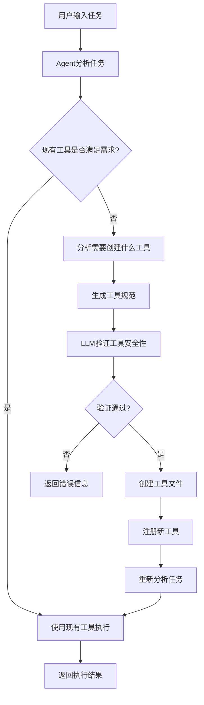

# 自然语言工具创建系统

## 概述

Agent具备通过自然语言识别任务需求并自动创建新工具的能力。当用户描述一个任务时，Agent会：

1. **分析任务需求** - 理解用户想要完成什么
2. **检查现有工具** - 评估当前工具是否能满足需求
3. **判断是否需要新工具** - 如果现有工具不足，决定创建新工具
4. **自动创建工具** - 生成相应的工具代码和配置
5. **验证工具安全性** - 确保新工具安全可靠
6. **立即可用** - 新工具创建后立即可以使用

## 核心功能

### 1. 智能任务分析

Agent使用LLM分析用户的任务描述：

```python
async def _analyze_tool_creation_need(self, task_description: str) -> Optional[Dict[str, Any]]:
    """分析是否需要创建新工具"""
    analysis_prompt = f"""
分析以下任务是否需要创建新工具：

任务描述：{task_description}

当前可用工具：
{self._generate_tool_summary_for_llm()}

请判断：
1. 现有工具是否能完成此任务？
2. 是否需要创建新工具？
3. 如果需要，请提供工具规范

返回JSON格式：
{{
    "need_new_tool": true/false,
    "reason": "原因",
    "tool_spec": {{
        "name": "工具名称",
        "description": "工具描述",
        "code": "Python代码",
        "parameters": {{"param1": "类型描述"}}
    }}
}}
"""
```

### 2. 自动工具创建

当检测到需要新工具时，Agent会自动创建：

```python
async def create_new_tool(self, tool_spec: Dict[str, Any]) -> Dict[str, Any]:
    """Agent创建新工具的方法"""
    # 1. 使用LLM验证工具规范
    validated_spec = await self._validate_tool_spec_with_llm(tool_spec)
    
    # 2. 创建工具文件
    new_tool = await self.dynamic_tool_creator.create_tool_from_spec(validated_spec)
    
    # 3. 注册到工具管理器
    self.add_tool(validated_spec["name"], new_tool)
    
    # 4. 重新加载系统提示词
    self.system_prompt = self._load_system_prompt()
```

### 3. 安全验证

每个新工具都会经过LLM验证：

```python
async def _validate_tool_spec_with_llm(self, tool_spec: Dict[str, Any]) -> Optional[Dict[str, Any]]:
    """使用LLM验证工具规范"""
    validation_prompt = f"""
请验证以下工具规范是否安全、完整和有效：

工具规范：
{json.dumps(tool_spec, ensure_ascii=False, indent=2)}

请检查：
1. 代码安全性（是否包含危险操作）
2. 参数完整性（是否定义了必要的参数）
3. 功能合理性（工具功能是否明确）
4. 命名规范性（工具名称是否合适）
"""
```

## 使用示例

### 示例1：创建图片处理工具

**用户输入：**
```
我需要一个工具来处理图片，能够调整图片的亮度、对比度和饱和度
```

**Agent分析过程：**
1. 分析任务需求：需要图片处理功能
2. 检查现有工具：发现没有图片处理工具
3. 决定创建新工具：`image_processor`
4. 生成工具代码：包含亮度、对比度、饱和度调整功能
5. 验证安全性：确保代码安全
6. 创建工具文件：`python/tools/dynamic/dynamic_image_processor.py`

**生成的工具：**
```python
class DynamicImageProcessorTool(BaseTool):
    """Dynamic tool: image_processor"""
    
    async def execute(self, **kwargs) -> ToolResult:
        # 图片处理逻辑
        # 亮度调整
        # 对比度调整
        # 饱和度调整
```

### 示例2：创建数据分析工具

**用户输入：**
```
我需要一个工具来分析CSV文件，计算平均值、中位数和标准差
```

**Agent分析过程：**
1. 分析任务需求：需要CSV数据分析功能
2. 检查现有工具：发现没有数据分析工具
3. 决定创建新工具：`csv_analyzer`
4. 生成工具代码：包含统计计算功能
5. 验证安全性：确保代码安全
6. 创建工具文件：`python/tools/dynamic/dynamic_csv_analyzer.py`

### 示例3：使用新创建的工具

**用户输入：**
```
使用图片处理工具调整一张图片的亮度为1.2倍
```

**Agent执行过程：**
1. 识别需要使用 `image_processor` 工具
2. 调用工具：传入亮度参数 1.2
3. 执行图片处理
4. 返回处理结果

## 工作流程



## 安全机制

### 1. 代码安全检查

Agent会检查新工具代码是否包含危险操作：

```python
def _validate_code_safety(self, code: str) -> bool:
    """验证代码安全性"""
    dangerous_keywords = [
        'import os', 'import sys', 'import subprocess',
        'eval(', 'exec(', '__import__', 'open(',
        'delete', 'remove', 'format', 'shutdown'
    ]
    
    code_lower = code.lower()
    for keyword in dangerous_keywords:
        if keyword in code_lower:
            return False
    
    return True
```

### 2. LLM验证

每个新工具都会经过LLM验证：

- **功能合理性**：工具功能是否明确
- **参数完整性**：是否定义了必要的参数
- **命名规范性**：工具名称是否合适
- **代码安全性**：是否包含危险操作

### 3. 参数验证

动态工具包含参数验证机制：

```python
def _validate_parameters(self, params: Dict[str, Any]) -> Dict[str, Any]:
    """验证参数"""
    # 字符串长度限制
    # 列表长度限制
    # 字典深度限制
    # 类型检查
```

## Web界面支持

### 1. 工具管理界面

在Web界面中可以：

- 查看所有工具（内置 + 动态）
- 查看工具统计信息
- 测试动态工具
- 删除动态工具

### 2. 实时日志

- 显示工具创建过程
- 显示工具执行日志
- 显示错误信息

### 3. 工具统计

- 内置工具数量
- 动态工具数量
- 工具使用次数
- 工具成功率

## 高级功能

### 1. 实时工具发现

使用 `watchdog` 监控文件系统变化：

```python
class DynamicToolDiscoveryHandler(FileSystemEventHandler):
    """文件系统事件处理器"""
    
    def on_created(self, event):
        """文件创建时自动加载新工具"""
        
    def on_modified(self, event):
        """文件修改时重新加载工具"""
        
    def on_deleted(self, event):
        """文件删除时移除工具"""
```

### 2. 工具模板生成

自动生成标准化的工具代码模板：

```python
def _generate_tool_template(self, name: str, code: str, parameters: Dict[str, Any]) -> str:
    """生成工具代码模板"""
    template = '''
class Dynamic{name_capitalized}Tool(BaseTool):
    """Dynamic tool: {name}"""
    
    async def execute(self, **kwargs) -> ToolResult:
        # 参数验证
        # 执行动态代码
        # 返回结果
    '''
```

### 3. 工具元数据管理

每个动态工具都有完整的元数据：

```json
{
    "name": "tool_name",
    "description": "工具描述",
    "code": "Python代码",
    "parameters": {"param1": "类型描述"},
    "category": "utility",
    "created_at": "2024-01-01T00:00:00",
    "usage_count": 0,
    "success_rate": 0.0
}
```

## 使用指南

### 1. 启动系统

```bash
# 启动Web服务器
python web/start_server.py

# 访问Web界面
# http://localhost:8000
```

### 2. 自然语言交互

直接在聊天界面输入任务描述：

```
我需要一个工具来计算复利
创建一个工具来生成随机密码
我需要一个工具来验证邮箱格式
```

### 3. 查看工具管理

点击"工具管理"按钮查看：

- 工具统计信息
- 内置工具列表
- 动态工具列表
- 工具使用情况

### 4. 测试新工具

在工具管理界面可以：

- 测试动态工具功能
- 查看工具详细信息
- 删除不需要的工具

## 示例任务

### 基础任务

```
我需要一个工具来计算BMI指数
创建一个工具来生成二维码
我需要一个工具来解析JSON数据
创建一个工具来验证身份证号码
```

### 高级任务

```
我需要一个工具来处理Excel文件，能够读取数据并生成图表
创建一个工具来分析文本情感，判断正面、负面或中性
我需要一个工具来生成随机测试数据
创建一个工具来压缩和解压文件
```

### 专业任务

```
我需要一个工具来进行数据清洗，处理缺失值和异常值
创建一个工具来生成API文档
我需要一个工具来进行图像识别
创建一个工具来监控系统资源使用情况
```

## 技术架构

### 核心组件

1. **Agent核心** (`python/agent/core.py`)
   - 任务分析
   - 工具创建决策
   - 工具执行管理

2. **动态工具创建器** (`python/agent/dynamic_tool_creator.py`)
   - 工具文件生成
   - 元数据管理
   - 文件系统监控

3. **Web界面** (`web/main.py`, `web/templates/index.html`)
   - 用户交互
   - 工具管理
   - 实时日志

4. **LLM集成** (`python/llm/deepseek_client.py`)
   - 任务分析
   - 工具规范生成
   - 安全验证

### 数据流

```
用户输入 → Agent分析 → LLM决策 → 工具创建 → 文件生成 → 工具注册 → 任务执行 → 结果返回
```

## 总结

自然语言工具创建系统实现了：

✅ **智能识别** - Agent能理解用户需求并判断是否需要新工具  
✅ **自动创建** - 无需手动编程，Agent自动生成工具代码  
✅ **安全验证** - 多层安全机制确保工具安全可靠  
✅ **立即可用** - 新工具创建后立即可以使用  
✅ **Web管理** - 完整的Web界面管理所有工具  
✅ **实时监控** - 文件系统监控支持热更新  

这个系统让Agent具备了自我进化的能力，能够根据用户需求自动扩展功能，是一个真正的智能助手系统。 